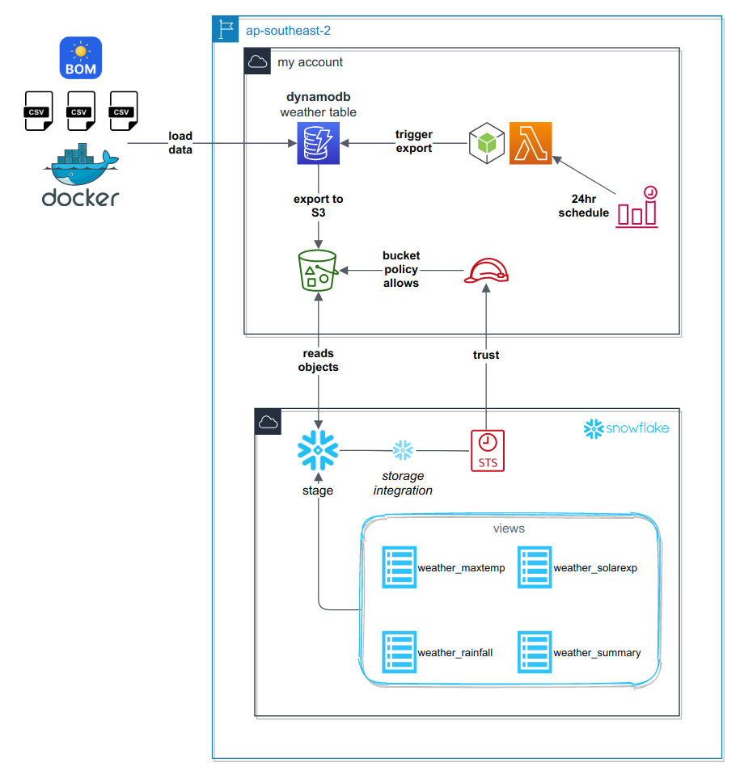

# Exporting DynamoDB to S3 for reading in Snowflake 

This repository accompanies a blog post on [Utilising DynamoDB Export to S3, to read NoSQL data from Snowflake](https://mechanicalrock.github.io/2020/11/30/dataops-dynamodb-to-snowflake.html). 

We help accelerate organisations in their quest to harness value from their data.  [Get in touch with Mechanical Rock](https://mechanicalrock.io/our-expertise/automated-data-platforms) to find out more.

## Quick Start

* Create the `.env` file with your parameters, based on the `env.sample` file format
* Create the Snowflake resources using the scripts in the `sql/` folder
* Deploy the infrastructure stack by running the `deploy.sh` script
* Load the sample data by running the `datafileload/load-data.sh` script

Read on for a deeper understanding.
## Architecture

The following diagram summarises what the solution achieves:
* A CDK app to manage the deployment of AWS Infrastructure as code
* Data files and a `docker-compose` configuration to load data into DynamoDB
* SQL scripts to normalize the DynamoDB data on S3 into relational tables in Snowflake



## Repository Layout

The following table describes some of the key assets in the repository and their purpose
|folder|purpose|
|-|-|
|`bin/`<br/>`lib/`<br/>`test/`| CDK project files for deploying the AWS Infrastructure|
|`datafileload/` | files and scripts for loading sample CSV data to DynamoDB|
|`sql/`|SQL scripts to create storage integrations, stages, and sql views in Snowflake|
|`src/lambda/`|code for the lambda that performs DynamoDB Export to S3|

## Deploying the infrastructure

All of these actions will need current AWS credentials either in profile or in shell environment variables.


In addition, this deployment relies on environment variables being set - the simplest way to manage this is to create a `.env` file in the root directory, based on the sample provided in the `env.sample` file. The variables are described below.

|variable               |source / usage|
|-----------------------|-|
|`AWS_DEFAULT_REGION`   |The region you wish to deploy to, e.g. `ap-southeast-2`|
|`AWS_ACCOUNT_ID`       |The account number you will deploy in to. You can fetch this with the AWS CLI by calling `aws sts get-caller-identity`|
|`DYNAMODB_TABLE_NAME`  |The name you want to give to your DynamoDB table|
|`SNOWFLAKE_ACCOUNT_ID` |The Snowflake account ID integration|
|`SNOWFLAKE_EXTERNAL_ID`|The Snowflake external ID from the storage integration|

In order to get the Snowflake variables above, you will first need to create a new storage integration in Snowflake - sample scripts are available in the `sql/storage-integration/` folder. When creating the storage integration you will need both the bucket name, and the IAM role that this stack will create. These follow the following format:

**Bucket:**
> `dynamodb-export-${AWS_ACCOUNT_ID}-${AWS_DEFAULT_REGION}`

**IAM role:**
> `arn:aws:iam::${AWS_ACCOUNT_ID}:role/dynamo-snowflake-s3-access-role`

### Convenience scripts

There are 3 scripts that can help you manage this solution
* `deploy.sh` - installs dependencies, runs tests, builds software and deploys to AWS
* `undeploy.sh` - removes the infrastructure and cleans up some of the dependencies and generated assets in the project folder
* `datafileload/load-data.sh` - uploads the data files in `datafileload/data` to your DynamoDB table. Note that this script relies on the `.env` file being configured with your table name and region.

### Lambda Export Schedule

The Lambda function to start the DynamoDB Export to S3 runs at 1am UTC each day; it is configured by a cron schedule in the file `lib/ddb2snow-export-dynamodb-stack.ts`. However, if you want to test it immediately, perform the following steps:

* Navigate to the AWS Lambda Console for your account and region specified above
* Select the Function with a name beginning `ddb2snowflake-DumpStack-dumpfunction...`
* Create a test event with the following data and save it as a named event
```json
{
    "time": "2020-11-30T00:00:00.000Z"
}
```
* Execute the Lambda Function with your named event

After a few minutes, you should be able to see your exported data files on S3.

## Cleaning up

To destroy the AWS infrastructure and clear out the local assets, run the `undeploy.sh` script